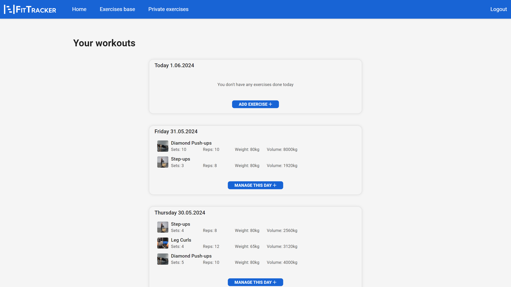
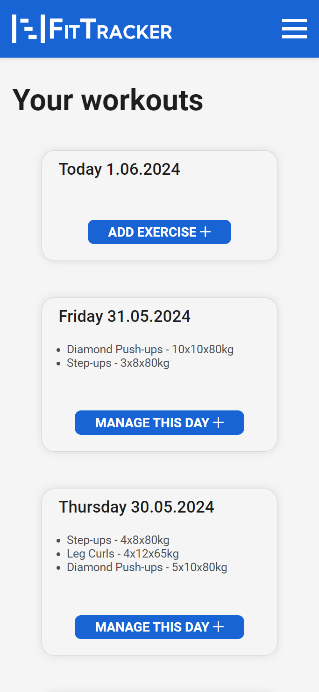
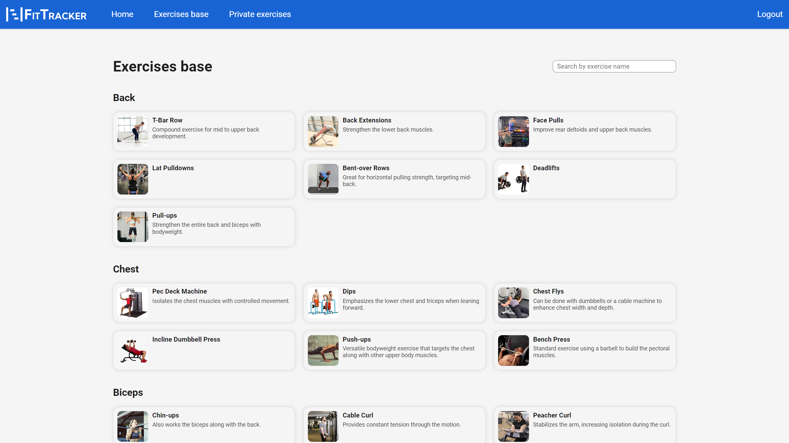
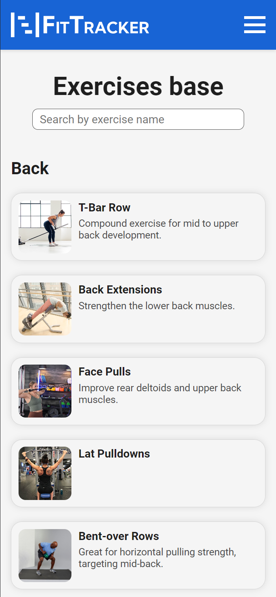
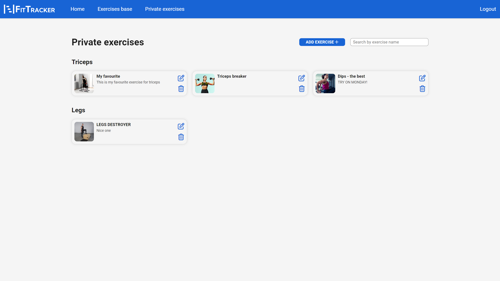
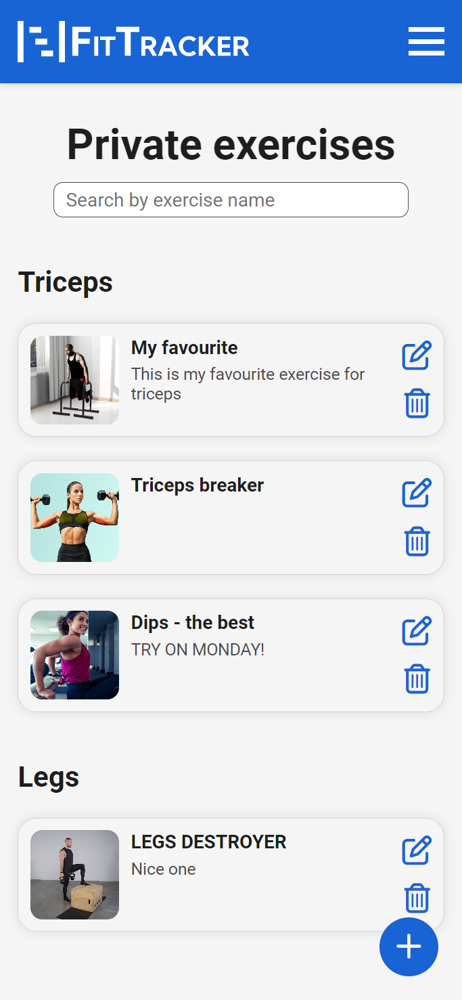
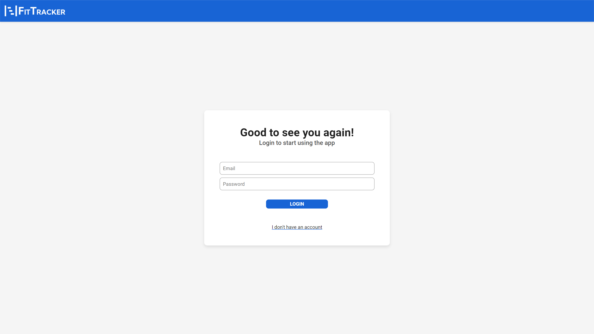
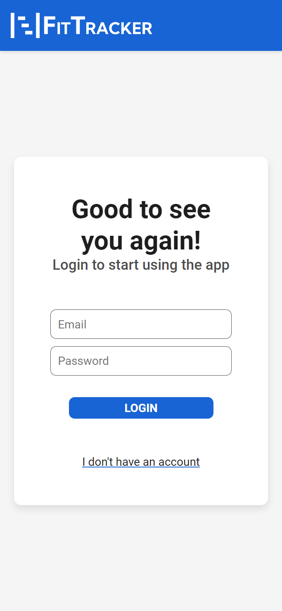
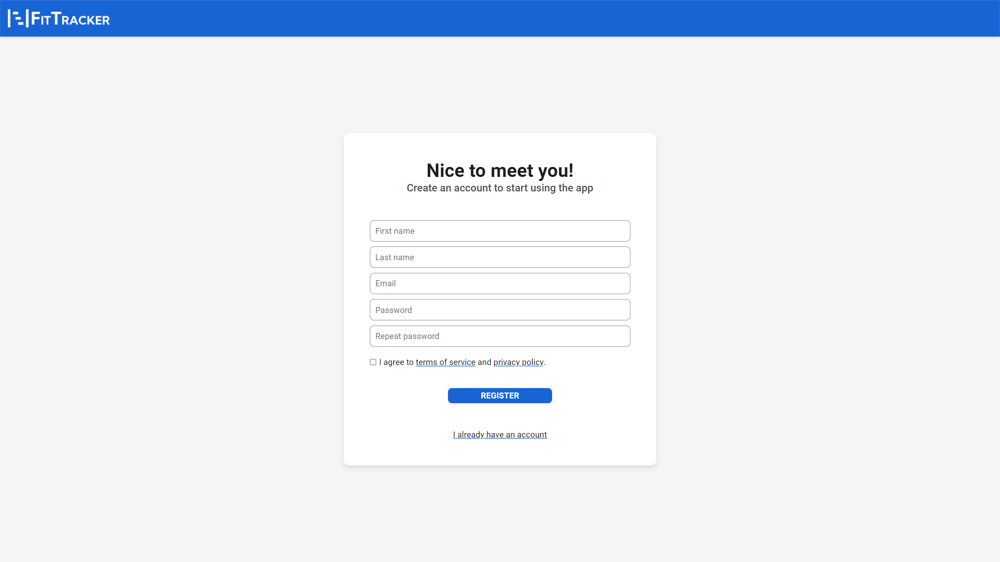
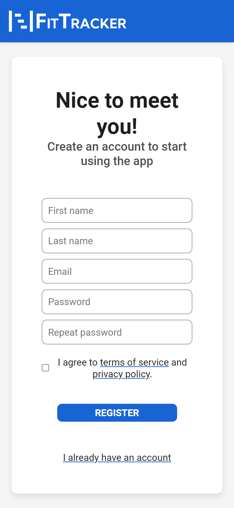

# FitTracker

"FitTracker" is a platform for tracking your gym workouts and your progress. The application allows you to add a list of your workouts as you go - just hit "Add exercise" and fill the details. We provide a base list of the most common exercises. Don't worry if you are not familiar with any given exercise - we present a video showing you how to perform it right. Don't worry if you can't find your favourite exercise - we provide option to create your own private exercises.

# Table of Contents

1. [Features](#features)
2. [Technology Stack](#technology-stack)
3. [Database Design and Structure](#database-design-and-structure)
4. [Setup](#setup)
5. [Usage](#usage)

## Features

- **Tracking workouts:** Add exercises and their details to each day you workout.
- **Learn new exercises:** Each base exercise comes with a description and a video showing you how to perform it.
- **Create private exercises:** If you didn't find your favourite exercise in the base list, you can create your own private exercise.
- **User Accounts:** Create your account to track your progress and access your data from anywhere.
- **Responsive Design:** Application is fully responsive to provide you with the best user experience.

## Technology Stack

Project is built using a variety of technologies and tools to ensure efficiency, performance, and scalability. Below is a list of the key components:

1. **Front-End: (ztpai-fittracker-fe)**

   - React: JavaScript library for building highly interactive user interfaces.
   - TypeScript: JavaScript superset for static typing.

2. **Back-End: (ztpai-fittracker)**

   - NestJS: Node.js framework for building scalable server-side applications.
   - PostgreSQL: Robust and scalable database management system.
   - Redis: Caching system for storing frequently accessed data in memory.

3. **Containerization:**

   - Docker: For creating, deploying, and running applications in containers.
   - Docker Compose: For defining and running multi-container Docker applications.

4. **Version Control:**

   - Git: For source code management.
   - GitHub: For hosting the repository and facilitating version control and collaboration.

## Database Design and Structure

The project includes a comprehensive design and structure for the database, ensuring efficient data storage and retrieval. Here are the key components:

1. **Entity-Relationship Diagram (ERD):**

   - The `erd.png` file in the main directory provides a visual representation of the database schema. This diagram is useful for understanding the relationships between different entities in the database.
   - [View ERD](./erd.png)

2. **Database Schema:**
   - Database definition together with seed data is located in the `src/migrations` directory. To run all of them, please use `npm run migration:run` command.

## Setup

Project is dockerized for easy setup and deployment. Follow these steps to get the project up and running:

1. **Clone the Repository**
2. **Navigate to the Project Directory**
3. **Docker Setup:**
   Ensure Docker and Docker Compose are installed on your system. In the project directory, you'll find Docker configuration files in the `docker/db`, `docker/nginx`, and `docker/php` directories, along with a `Dockerfile` in each.
4. **Build Docker Images:**
   `docker-compose build`
5. **Start Docker Containers:**
   `docker-compose up`
6. **Access the Application:**
   After the containers are up and running, you can access the application through your web browser. By default, the frontend application runs on `http://localhost:5173`.

## Usage

### Home Page

The home page allows to add and manage workouts. It's divided into days, where each day has its separate list of exercises.
Desktop | Mobile
:-------------------------:|:-------------------------:
 | 

### Exercises Base

This page allows users to browse the base list of exercises. Each exercise comes with a description and a video showing how to perform it. Admins can manage the list of base exercises.
Desktop | Mobile
:-------------------------:|:-------------------------:
 | 

### Private Exercises

This page allows users to create their own private exercises. These exercises are visible only to the user who created them.
Desktop | Mobile
:-------------------------:|:-------------------------:
 | 

### Login

The login page allows users to sign in to their accounts.
Desktop | Mobile
:-------------------------:|:-------------------------:
 | 

### Registration

The registration page allows new users to create an account.
Desktop | Mobile
:-------------------------:|:-------------------------:
 | 
